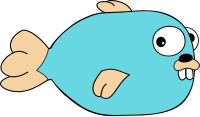

 # Gofish - Redfish and Swordfish client library

[](http://godoc.org/github.com/stmcginnis/gofish)
[](https://goreportcard.com/report/github.com/stmcginnis/gofish)
[](https://github.com/stmcginnis/gofish/releases)
[](https://github.com/stmcginnis/gofish/blob/main/LICENSE)



## Introduction

Gofish is a Golang library for interacting with [DMTF
Redfish](https://www.dmtf.org/standards/redfish) and [SNIA
Swordfish](https://www.snia.org/forums/smi/swordfish) enabled devices.

## Usage ##

Basic usage would be:

```go

package main

import (
    "fmt"

    "github.com/stmcginnis/gofish"
)

func main() {
    c, err := gofish.ConnectDefault("http://localhost:5000")
    if err != nil {
        panic(err)
    }

    service := c.Service
    chassis, err := service.Chassis()
    if err != nil {
        panic(err)
    }

    for _, chass := range chassis {
        fmt.Printf("Chassis: %#v\n\n", chass)
    }
}
```
